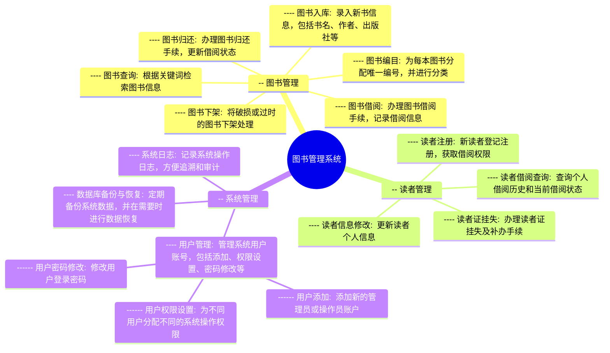
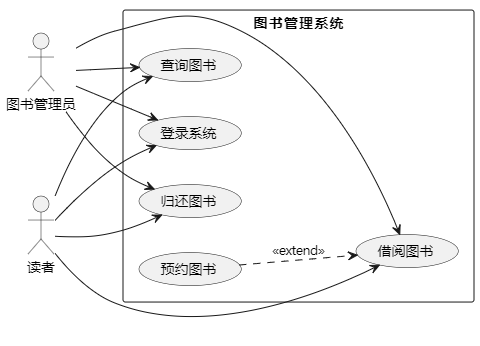
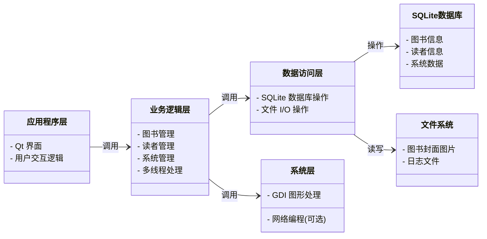
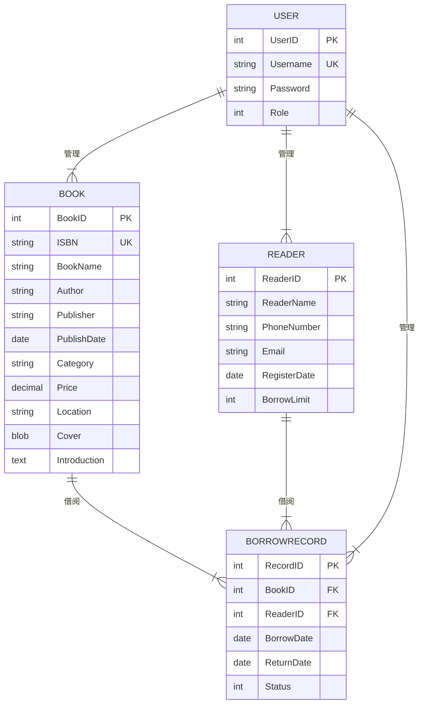
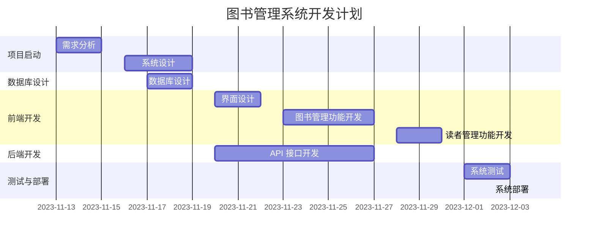

# 图书管理系统



##  功能解释：



**图书管理:**

* **[图书入库](./requirement/图书入库.md):**  将新购置的图书信息录入系统，包括书名、作者、出版社、ISBN、价格、存放位置等。[图书入库界面原型](./prototype/图书入库.html)
* **图书编目:**  为每本图书分配唯一的索书号，并根据图书分类法进行分类，方便查找和管理。
* **图书查询:**  提供多种查询方式，例如按书名、作者、ISBN、关键词等检索图书信息。
* **图书借阅:**  读者借阅图书时，记录借阅信息，包括借阅日期、应还日期等，并更新图书状态。
* **图书归还:**  读者归还图书时，更新图书状态，并计算逾期费用（如有）。
* **图书下架:**  将破损、过时或不再需要的图书进行下架处理，并更新图书库存信息。

**读者管理:**

* **读者注册:**  新读者填写个人信息进行注册，获取借阅证和借阅权限。
* **读者信息修改:**  允许读者更新个人信息，例如联系方式、地址等。
* **读者借阅查询:**  读者可以查询自己的借阅历史记录，包括已归还图书和当前借阅图书的信息。
* **读者证挂失:**  读者证丢失或损坏时，可以办理挂失手续，并申请补办新证。

**系统管理:**

* **用户管理:**  
    * **用户添加:**  添加新的管理员或操作员账户，分配不同的角色和权限。
    * **用户权限设置:**  为不同用户分配不同的系统操作权限，例如图书管理、读者管理、系统设置等。
    * **用户密码修改:**  允许用户修改自己的登录密码，保障账户安全。
* **系统日志:**  记录系统所有操作的日志信息，包括操作时间、操作用户、操作内容等，方便追溯和审计。
* **数据库备份与恢复:**  定期备份系统数据库，防止数据丢失，并在需要时进行数据恢复。

## 架构设计



**解释：**

* **应用程序层（Presentation Layer）：** 负责用户界面展示和用户交互逻辑处理，使用 Qt 框架实现。
* **业务逻辑层（Business Logic Layer）：** 处理核心业务逻辑，例如图书管理、读者管理、系统管理等，并使用多线程技术提高效率。
* **数据访问层（Data Access Layer）：** 负责与数据库和文件系统进行交互，进行数据读写操作，使用 SQLite 数据库和文件 I/O 操作实现。
* **系统层（System Layer）：** 提供底层系统功能支持，例如图形处理和网络编程，使用 GDI 图形处理技术，并根据需要选择是否使用网络编程技术。

**各层级关系：**

* 应用程序层调用业务逻辑层提供的功能接口。
* 业务逻辑层调用数据访问层提供的数据库和文件操作接口。
* 业务逻辑层根据需要调用系统层提供的图形处理和网络编程接口。

**其他组件：**

* **SQLite 数据库：** 存储图书信息、读者信息、系统数据等。
* **文件系统：** 存储图书封面图片、日志文件等。

**网络编程 (可选)：**

* 如果需要实现远程访问、数据同步等功能，可以添加网络编程模块，例如使用 TCP/IP 协议进行网络通信。

**图形化界面 (Qt)：**

* Qt 框架用于构建用户界面，提供丰富的 UI 控件和布局管理器，方便开发人员创建美观易用的应用程序界面。

**多线程处理：**

* 多线程技术可以将耗时的操作放到后台线程执行，避免阻塞主线程，提高应用程序的响应速度和用户体验。

**数据库存储 (SQLite)：**

* SQLite 是一款轻量级嵌入式数据库，适用于存储结构化数据，例如图书信息、读者信息等。

**文件 I/O 操作：**

* 文件 I/O 操作用于读写文件系统中的文件，例如读取图书封面图片、写入日志文件等。

**GDI 图形处理：**

* GDI (Graphics Device Interface) 是 Windows 操作系统提供的图形设备接口，可以用于绘制图形、显示图像等。


希望这个系统架构图能够帮助你理解该图书管理系统的结构和技术实现！ 

## 数据库结构

以下是图书管理系统 SQLite 数据库结构设计，包含创建表的 SQL 语句：



**关系说明：**

- **图书 - 借阅记录 (1:N)：** 一本书可以被多个读者借阅，产生多条借阅记录。
- **读者 - 借阅记录 (1:N)：** 一个读者可以借阅多本书，产生多条借阅记录。
- **用户 - 图书 (1:N)：** 管理员可以管理多本书籍信息。
- **用户 - 读者 (1:N)：** 管理员可以管理多个读者信息。
- **用户 - 借阅记录 (1:N)：** 管理员可以管理多条借阅记录。

```sql
-- 图书表
CREATE TABLE Book (
    BookID INTEGER PRIMARY KEY AUTOINCREMENT, -- 图书ID，主键，自增
    ISBN TEXT UNIQUE NOT NULL, -- ISBN，唯一，非空
    BookName TEXT NOT NULL, -- 书名，非空
    Author TEXT NOT NULL, -- 作者，非空
    Publisher TEXT NOT NULL, -- 出版社，非空
    PublishDate DATE, -- 出版日期
    Category TEXT, -- 图书分类
    Price REAL, -- 价格
    Location TEXT, -- 存放位置
    Cover BLOB, -- 封面图片，二进制数据
    Introduction TEXT -- 内容简介
);

-- 读者表
CREATE TABLE Reader (
    ReaderID INTEGER PRIMARY KEY AUTOINCREMENT, -- 读者ID，主键，自增
    ReaderName TEXT NOT NULL, -- 读者姓名，非空
    PhoneNumber TEXT, -- 联系电话
    Email TEXT, -- 电子邮箱
    RegisterDate DATE DEFAULT (date('now')), -- 注册日期，默认为当前日期
    BorrowLimit INTEGER DEFAULT 3 -- 借阅上限，默认为3本
);

-- 借阅记录表
CREATE TABLE BorrowRecord (
    RecordID INTEGER PRIMARY KEY AUTOINCREMENT, -- 借阅记录ID，主键，自增
    BookID INTEGER NOT NULL, -- 图书ID，外键关联图书表
    ReaderID INTEGER NOT NULL, -- 读者ID，外键关联读者表
    BorrowDate DATE DEFAULT (date('now')), -- 借阅日期，默认为当前日期
    ReturnDate DATE, -- 归还日期
    Status INTEGER DEFAULT 0, -- 借阅状态，0: 未归还，1: 已归还，2: 逾期
    FOREIGN KEY (BookID) REFERENCES Book(BookID),
    FOREIGN KEY (ReaderID) REFERENCES Reader(ReaderID)
);

-- 用户表
CREATE TABLE User (
    UserID INTEGER PRIMARY KEY AUTOINCREMENT, -- 用户ID，主键，自增
    Username TEXT UNIQUE NOT NULL, -- 用户名，唯一，非空
    Password TEXT NOT NULL, -- 密码，非空
    Role INTEGER DEFAULT 0 -- 角色，0: 管理员，1: 普通用户
);
```

**表结构说明：**

**1. 图书表 (Book):**

*   `BookID`: 图书的唯一标识符，主键，自动递增。
*   `ISBN`: 国际标准书号，用于唯一标识一本书，非空且唯一。
*   `BookName`: 书名，非空。
*   `Author`: 作者，非空。
*   `Publisher`: 出版社，非空。
*   `PublishDate`: 出版日期。
*   `Category`: 图书分类，例如：文学、科技、艺术等。
*   `Price`: 图书价格。
*   `Location`: 图书存放位置，例如：图书馆的具体书架号。
*   `Cover`: 图书封面图片，以二进制数据存储。
*   `Introduction`: 图书内容简介。

**2. 读者表 (Reader):**

*   `ReaderID`: 读者的唯一标识符，主键，自动递增。
*   `ReaderName`: 读者姓名，非空。
*   `PhoneNumber`: 读者联系电话。
*   `Email`: 读者电子邮箱地址。
*   `RegisterDate`: 读者注册日期，默认为当前日期。
*   `BorrowLimit`: 读者可借阅图书的最大数量，默认为 3 本。

**3. 借阅记录表 (BorrowRecord):**

*   `RecordID`: 借阅记录的唯一标识符，主键，自动递增。
*   `BookID`: 借阅图书的 ID，外键关联到图书表 (Book)。
*   `ReaderID`: 借阅者的 ID，外键关联到读者表 (Reader)。
*   `BorrowDate`: 借阅日期，默认为当前日期。
*   `ReturnDate`: 归还日期，初始值为 NULL，归还时更新。
*   `Status`: 借阅状态，0 表示未归还，1 表示已归还，2 表示逾期。

**4. 用户表 (User):**

*   `UserID`: 用户的唯一标识符，主键，自动递增。
*   `Username`: 用户名，用于登录系统，非空且唯一。
*   `Password`: 用户密码，非空。
*   `Role`: 用户角色，0 表示管理员，拥有所有权限，1 表示普通用户，权限受限。

**关系：**

*   图书表和读者表之间是多对多关系，通过借阅记录表关联。
*   每条借阅记录关联一本图书和一个读者。

**其他说明：**

*   可以根据实际需求添加或修改字段。
*   可以使用 SQLiteStudio 等工具创建和管理数据库。
*   在应用程序中，可以使用 SQL 语句或 ORM 框架来操作数据库。

## 项目开发计划



