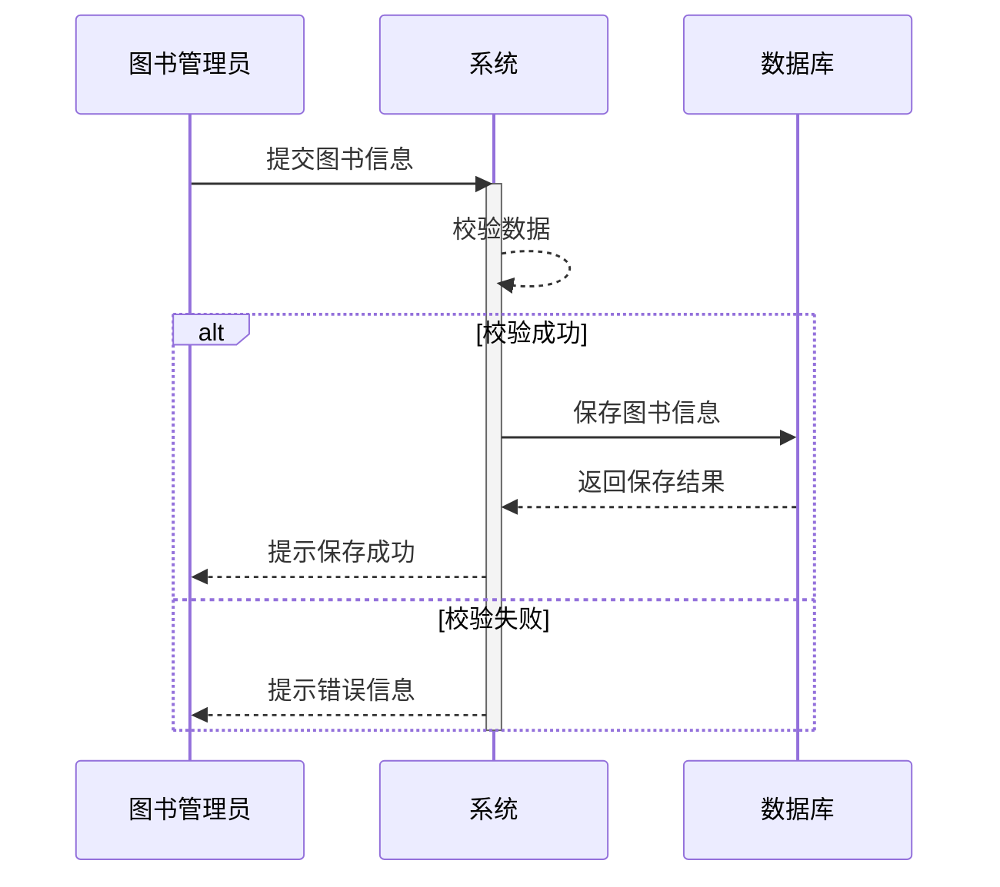

## 图书入库需求文档 (PRD)

**1.  概述**

**1.1.  目的**

本需求文档旨在详细描述图书管理系统中“图书入库”功能的需求，为开发团队提供明确的开发方向和验收标准。

**1.2.  目标用户**

图书馆管理员

**1.3.  使用场景**

当图书馆购置新书或收到捐赠图书后，管理员需要将新图书信息录入系统，以便进行后续的编目、上架和借阅管理。

**2.  功能需求**

**2.2.  功能描述**

* **手动录入图书信息：**
    * 管理员可以通过系统界面手动输入每本图书的信息，包括：
        * ISBN：必填，且需保证唯一性
        * 书名：必填
        * 作者：必填
        * 出版社：必填
        * 出版日期：必填
        * 图书分类：必填
        * 价格：必填
        * 存放位置：必填
        * 图书封面：可选，支持上传图片
        * 内容简介：可选
    * 系统应提供字段校验功能，例如：
        * ISBN 是否符合规范
        * 必填字段是否为空
        * 价格是否为数字
    * 校验通过后，将图书信息保存至数据库。
* **批量导入图书信息：**
    * 管理员可以通过上传 Excel 文件的方式批量导入图书信息。
    * 系统应提供 Excel 模板文件下载，方便管理员整理数据。
    * 系统应校验 Excel 文件格式和数据有效性。
    * 校验通过后，将图书信息批量保存至数据库。

**2.3.  时序图**

**3.  非功能需求**

* **易用性：**  系统界面简洁易懂，操作流程清晰，方便管理员快速完成图书入库操作。
* **安全性：**  系统应具备必要的安全机制，防止数据泄露和恶意篡改。
* **性能：**  系统响应速度快，能够高效处理大量图书信息的导入和保存。

**4.  验收标准**

* 管理员能够成功手动录入单本图书信息。
* 管理员能够成功批量导入多本图书信息。
* 系统能够对录入和导入的图书信息进行有效性校验。
* 图书信息能够正确保存至数据库。

**5.  其他**

本 PRD 文档仅描述了图书入库功能的核心需求，开发过程中可能还会涉及其他细节问题，需要开发团队与需求方进一步沟通确认。

